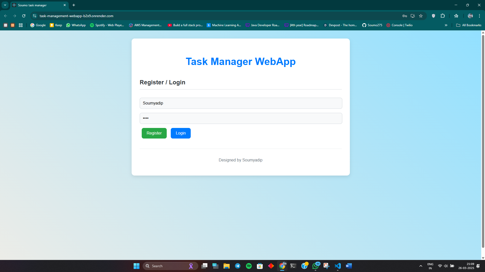
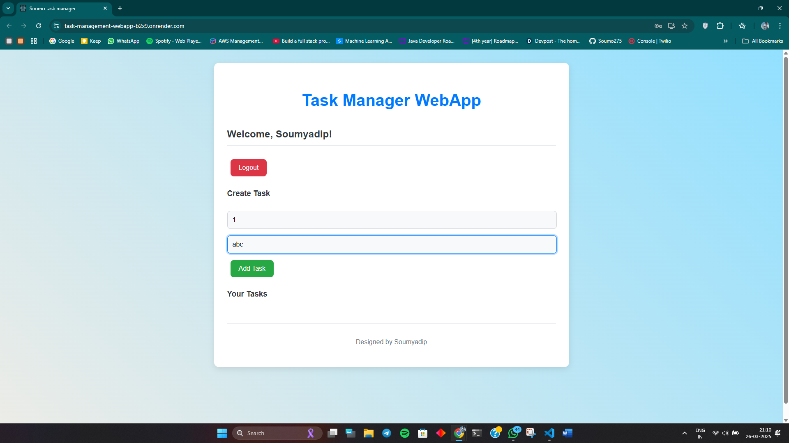
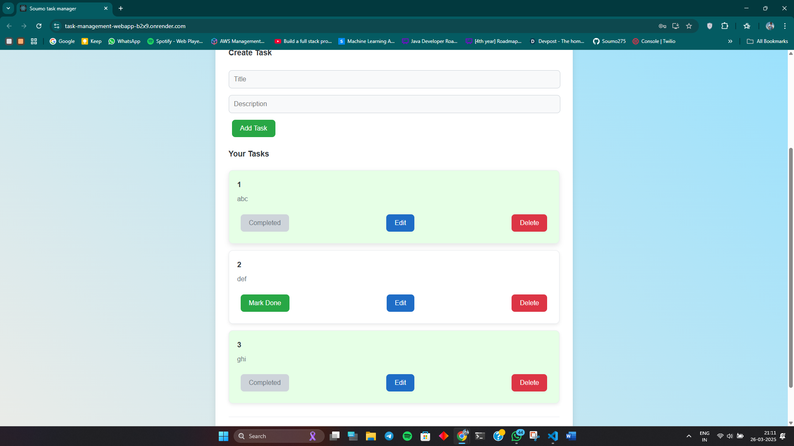

# Task Manager Web Application

**Deployment Link:**[(https://task-management-webapp-b2x9.onrender.com/)]

steps to use :

1. click on the link above
2. fill name and password fields
3. click on the register button , (a pop-up shows if successful)
4. login with the same credentials
5. you can add task by clicking on the add task button
6. you can delete task by clicking on the delete task button
7. you can edit task by clicking on the edit task button
8. logout of the session using the logout button

## Overview

This is a modern and user-friendly Task Manager Web Application built with React, Axios, and a backend API. It allows users to register, log in, create, manage, and delete tasks. The application features a clean, responsive design with a focus on usability and a modern aesthetic.

Users can:

- Register and log in securely.
- Create new tasks with titles and descriptions.
- Mark tasks as completed.
- Delete tasks.
- View all their tasks in a clear, organized list.

The application utilizes cloud storage for token-based authentication, ensuring a seamless user experience.

<br>

## Features

- **User Authentication:** Secure registration and login functionality.
- **Task Management:** Create, read, update (mark as done), and delete tasks.
- **Responsive Design:** Works well on various screen sizes.
- **Modern UI:** Clean and intuitive user interface.
- **Token-Based Authentication:** Uses local storage for secure session management.
- **API Integration:** Uses Axios to communicate with a backend API.

<br>

## Technologies Used

- **React:** For building the user interface.
- **Axios:** For making HTTP requests to the backend API.
- **CSS:** For styling the application.
- **Local Storage:** For storing authentication tokens.

<br>

## Installation

1.  **Clone the repository:**

    ```bash
    git clone [YOUR_REPOSITORY_LINK_HERE]
    ```

2.  **Navigate to the project directory:**

    ```bash
    cd [PROJECT_DIRECTORY]
    ```

3.  **Install dependencies:**

    ```bash
    npm install
    ```

4.  **Set up environment variables:**

    - Create a `.env.local` file in the root of the project.
    - Add the following environment variable, replacing `[YOUR_BACKEND_API_URL]` with your actual backend API URL:

      ```
      REACT_APP_BASE_URL=[YOUR_BACKEND_API_URL]
      ```

5.  **Start the development server:**

    ```bash
    npm start
    ```

6.  **Open the application in your browser:**

    - Go to `http://localhost:3000`

<br>

## Screenshots

<br><br>

**Login Page**
<br>

<br><br>

**Task List**
<br>
[]
<br><br>

**Task Creation**
<br>
[]

<br>

## Backend API

This application requires a backend API to function using expressjs. Ensure that the API is running and configured correctly.

<br>
